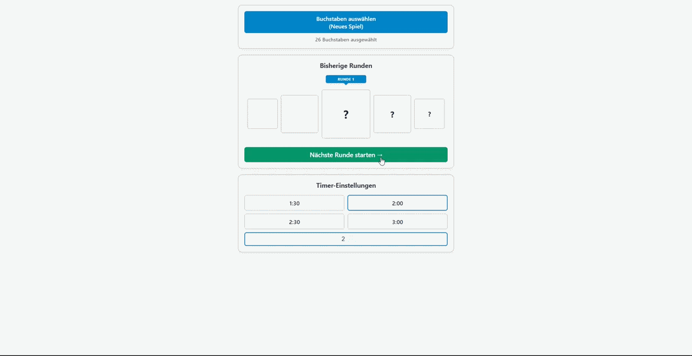

# Stadt-Land-Fluss (Begleiter-App)

## [im Browser öffnen →](https://schwanniii.github.io/Stadt-Land-Fluss/)

  

 

## Funktionen

* **Buchstaben auswählen:** Wähle Buchstaben ab und spiele z.B. ohne Q,X,Y und Z.
* **zufällige Buchstaben:** Starte die neue Runde mit einem neuen, zufälligen Buchstaben.
* **Timer:** Das Zeitende wird durch einen Farbumschlag und einen Signalton signalisiert.
* **Beispielantworten:** Schaue Dir Beispiele für den jeweiligen Buchstaben zu bestimmten Kategorien an.
  
  ---

## Feedback

[Fehler melden](https://github.com/schwanniii/Stadt-Land-Fluss/issues) - [Feature vorschlagen](https://github.com/schwanniii/Stadt-Land-Fluss/issues)

